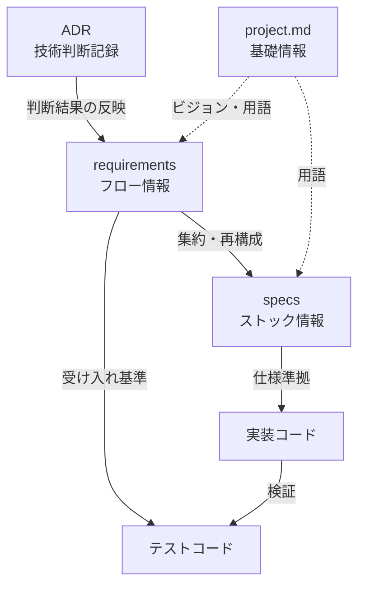

# ドキュメント構造ガイド

## なぜ Git でドキュメントを管理するのか

AI駆動開発では、AIに渡す「コンテキスト」の質がアウトプットの質を決定する。
仕様書・コーディング規約・テスト戦略をGitリポジトリで管理することで、コードと同じバージョン管理・レビュープロセスに乗り、一定品質以上のコードが安定して生成される仕組みを実現する。

## 2つの中心概念：フローとストック

このプロジェクトのドキュメントは「フロー情報」と「ストック情報」の2層で管理する。

### フロー情報（requirements/）

「いつ・なぜ決めたか」の時系列記録。チケットごとにファイルが増え続ける。

- 機能単位の要件定義
- ビジネスルールの決定事項
- 受け入れ基準
- 仕様変更の経緯（ADDED / MODIFIED / REMOVED）

### ストック情報（specs/）

「今どうなっているか」の統合仕様。ファイル数はドメインごとにほぼ一定。

- ドメイン概要
- API仕様
- ドメインモデル定義

### 両者の関係

```text
requirements → 集約・再構成 → specs
（時系列の断面記録）      （現時点の統合仕様）
```

仕様を変更する際は、必ず requirements に経緯を記録してから specs を更新する。

### ドキュメント間の関係



- 実線: データの流れ（依存関係）
- 点線: 参照関係
- ADR の判断結果は直接 specs に反映せず、必ず requirements を経由する

## ディレクトリ構造

```text
docs/
├── project.md         ← プロダクト基礎情報（ビジョン・制約）
├── requirements/      ← フロー情報
├── specs/             ← ストック情報
├── adr/               ← 技術判断の意思決定記録
├── qa/                ← テスト方針・基準
└── guides/            ← 運用ガイド（このファイル群）
```

### ADR の位置づけ

ADR（Architecture Decision Records）は requirements とも specs とも異なるライフサイクルを持つ。

- requirements: フロー → specs に集約される
- specs: 常に最新を反映（上書き更新）
- **ADR: 書いた時点の姿のまま永続する（追記専用）**

判断の結果は specs に反映されるが、「なぜその選択をしたか」の経緯は ADR にしか残らない。この性質の違いから docs/ 直下に独立ディレクトリとして配置している。

### qa/ には何が入るか

テストコード（*.spec.ts 等）は tests/ や e2e/ に配置する。qa/ に格納するのは「テストをどういう思想で書くか」を定義するドキュメントのみ。AIがテストを生成する際の品質基準として機能する。

- test-strategy.md: テストピラミッド方針・カバレッジ目標・CI実行ポリシー
- e2e-guidelines.md: POM規約・非同期待ちルール・セレクタ戦略
- test-data-management.md: シード/ファクトリ方針・マスキング規約
- performance-criteria.md: レスポンスタイム基準・スループット閾値

## CLAUDE.md の分割管理

CLAUDE.md にはプロジェクト全体に共通する最小限の情報のみを記載する。

| 情報                                   | 配置場所                              |
| -------------------------------------- | ------------------------------------- |
| 技術スタック・全体アーキ               | CLAUDE.md（ルート）                   |
| ドキュメントワークフロー               | .claude/rules/document-workflow.md    |
| コーディング規約の詳細                 | .claude/rules/coding-style.md         |
| Git運用ルール・ブランチ規約            | .claude/rules/git-workflow.md         |
| ドメイン固有ルール                     | 各サブディレクトリの .claude.md       |

コンテキストウィンドウを圧迫せず「必要な時に必要な分だけ」AIに読ませる設計を徹底する。

### コンテキスト優先度

<!-- この優先度は CLAUDE.md の「作業開始時の確認」セクションと対応する -->

プロジェクトが大規模化し、1つのタスクで読むべきファイルが多い場合の優先度:

1. **必須**: CLAUDE.md + .claude/rules/ + 対象 requirements + 対象 specs/overview.md
2. **高**: 対象 specs の api.md / domain-model.md + 関連 ADR
3. **中**: 他ドメインの overview.md（クロスドメイン参照がある場合）
4. **低**: docs/qa/ + docs/guides/（方針確認が必要な場合のみ）
